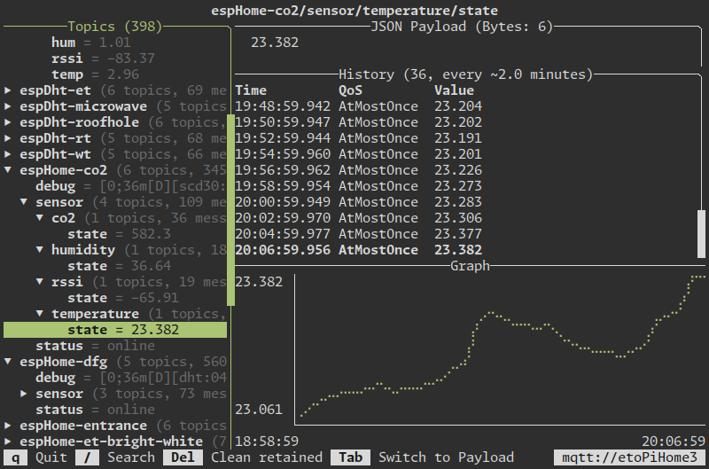

# MQTT TUI

Subscribe to a MQTT Topic or publish something quickly from the terminal

## Features

### Terminal UI



```bash
# Subscribe to everything (#)
mqttui

# Subscribe to topic
mqttui "topic"

# Subscribe to topic with a specific host (default is mqtt://localhost)
mqttui --broker "mqtt://test.mosquitto.org" "hello/world"

# More arguments and details
mqttui --help
```

### Publish

```bash
mqttui publish "hello" "world"

mqttui publish --retain "foo/bar" "Banana?"

# Use stdin to publish file contents
mqttui publish "foo/bar" </etc/hostname
# or other things
cowsay "I was here" | mqttui publish "foo/bar"

# More arguments and details
mqttui publish --help
```

### Log to stdout

```plaintext
$ mqttui log "espHome-co2/sensor/#" "espHome-test/sensor/temperature/state"
RETAINED     espHome-co2/sensor/rssi/state                      QoS:AtMostOnce  Payload(  6): -80.09
RETAINED     espHome-co2/sensor/co2/state                       QoS:AtMostOnce  Payload(  5): 450.8
RETAINED     espHome-co2/sensor/temperature/state               QoS:AtMostOnce  Payload(  6): 22.129
RETAINED     espHome-co2/sensor/humidity/state                  QoS:AtMostOnce  Payload(  5): 25.18
RETAINED     espHome-test/sensor/temperature/state              QoS:AtMostOnce  Payload(  6): 10.339
12:10:06.650 espHome-test/sensor/temperature/state              QoS:AtMostOnce  Payload(  6): 10.454
12:10:39.606 espHome-co2/sensor/co2/state                       QoS:AtMostOnce  Payload(  5): 432.5
12:10:53.860 espHome-co2/sensor/temperature/state               QoS:AtMostOnce  Payload(  6): 21.974
12:12:06.644 espHome-test/sensor/temperature/state              QoS:AtMostOnce  Payload(  6): 10.536
12:12:39.556 espHome-co2/sensor/co2/state                       QoS:AtMostOnce  Payload(  5): 404.3
12:12:53.859 espHome-co2/sensor/temperature/state               QoS:AtMostOnce  Payload(  6): 21.921
12:13:20.146 espHome-co2/sensor/humidity/state                  QoS:AtMostOnce  Payload(  5): 25.11
12:13:27.906 espHome-co2/sensor/rssi/state                      QoS:AtMostOnce  Payload(  6): -79.81
12:14:06.643 espHome-test/sensor/temperature/state              QoS:AtMostOnce  Payload(  6): 10.568
```

```bash
# Subscribe to topic
mqttui log "topic"

# Multiple topics
mqttui log "topic1" "topic2"

# More arguments and details
mqttui log --help
```

### Read a single payload to stdout

In scripts, it's helpful to get the current payload of a specific topic.

```bash
# Print the first received message to stdout and the topic to stderr
mqttui read-one room/temp

# Save the payload to a bash variable to use it
temp=$(mqttui read-one room/temp)
echo "The temperature is $temp right now"

# Wait for a non retained message (default when there is none)
temp=$(mqttui read-one --ignore-retained room/temp)
echo "Breaking news: We just received an updated temperature of $temp"

# More arguments and details
mqttui read-one --help
```

### Clean retained topics

Use the interactive TUI and press Delete or Backspace on a topic to clean the tree or use the sub-command.


```plaintext
$ mqttui publish --retain "hello" "world"

$ mqttui clean-retained "hello"
RETAINED     hello          QoS:AtLeastOnce Payload(  5): world
Cleaned 1 topics
```

```bash
# Clean the topic
mqttui clean-retained "topic"

# Clean the topic tree below
mqttui clean-retained "topic/#"

# More arguments and details
mqttui clean-arguments --help
```

### Configure via environment variables

See the `--help` command for environment variables to be set.

Personally I have set my default broker, so I don't have to use `--broker` all the time:

```bash
export MQTTUI_BROKER=mqtt://pi-home.local

# Use the command without specifying the broker every time
mqttui "topic"
```

## Install

### Prebuilt

[](https://repology.org/project/mqttui/versions)

#### Arch Linux

```bash
pacman -S mqttui
```

#### Homebrew (Mac or Linux)

```bash
brew install mqttui
```

#### Other

Check the [Releases](https://github.com/EdJoPaTo/mqttui/releases).

### From Source

- Clone this repository
- `cargo install --path .`

## History and Alternatives

Taking a look into existing "lets just view MQTT right now" or "quickly publish something" projects they are always quite bulky and not that fast.

Before having `mqttui` I used [thomasnordquist/MQTT-Explorer](https://github.com/thomasnordquist/MQTT-Explorer) as it has a great overview of what's going on, a small topic based history and a sorted main view.
But while it's running its eating up a lot of resources.

Publishing something quickly from command line is also not that fun.
The feature rich CLI alternative [hivemq/mqtt-cli](https://github.com/hivemq/mqtt-cli) takes some time to do its job and is not as easy to use as it has a lot of flags to specify.
Subscribing to many topics also isn't as useful to watch at as I hoped for.

While [`mosquitto_sub` and `mosquitto_pub`](https://mosquitto.org/) are bundled when installing Mosquitto they are also a bit bulky to use.

That's why I started building my own terminal based version to quickly watch or publish MQTT stuff.
It won't be as feature rich as something like the HiveMQ CLI approach, but it aims at being easy to use and fast.
